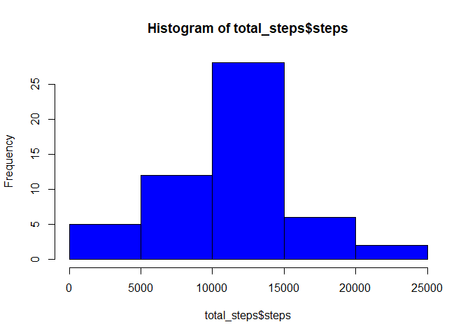
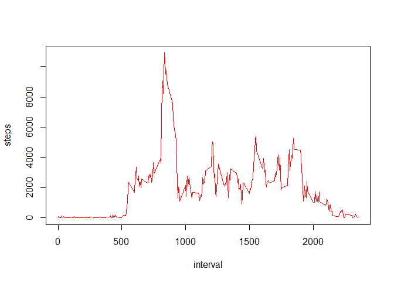
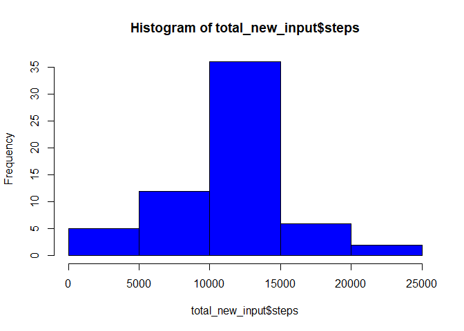
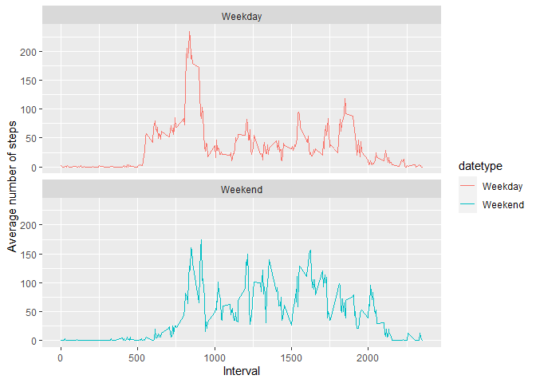

Assignment 1 (Reproducible Results)
===================================

### Loading and Preprocessing the Data

We will load the data.

    data <- read.csv("activity.csv", header=TRUE)

### What is the mean total number of steps taken per day?

1.  First we calculate the total number of steps taken per day
2.  Then, we plot the histogram of the total number of steps taken each
    day

<!-- -->

    total_steps <- aggregate(steps~date,data,FUN=sum,na.rm=TRUE)
    hist(total_steps$steps,col="blue")

1.  Lastly we will calculate and report the mean and median of the total
    number of steps taken per day.

<!-- -->

    mean(total_steps$steps)

    ## [1] 10766.19

    median(total_steps$steps)

    ## [1] 10765

### What is the average daily activity pattern?

1.  Make a time series plot (i.e. type = "l") of the 5-minute interval
    (x-axis) and the average number of steps taken, averaged across all
    days (y-axis)

<!-- -->

    interval_steps <- aggregate(steps~interval,data=data,FUN=sum,na.rm=TRUE)
    plot(steps~interval,data=interval_steps,type="l",col="red")

1.  Which 5-minute interval, on average across all the days in the
    dataset, contains the maximum number of steps?

<!-- -->

    interval_steps[which.max(interval_steps$steps),]$interval

    ## [1] 835

### Inputing Missing Values

1.  We calculate the total number of missing NAs

<!-- -->

    missingvalues <- sum(is.na(data$steps))
    missingvalues

    ## [1] 2304

1.  Next, we devised a stratgey to fill in the missing values. We will
    be using the mean of the daily steps. We store this is new\_input.

<!-- -->

    interval_steps <- aggregate(steps~interval,data=data,FUN=sum,na.rm=TRUE)
    input_steps <- interval_steps$steps[match(data$interval,interval_steps$interval)]

1.  We create a new data set with all the NA values filled in.

<!-- -->

    new_input_data <- transform(data,steps = ifelse(is.na(data$steps),yes=input_steps,no=data$steps))

1.  Now, we create the new histogram to compare to the old histogram. We
    also compute the mean and median of the total number of steps taken

<!-- -->

    total_new_input <- aggregate(steps~date, data = new_input_data, FUN=sum)
    names(total_new_input) <-c("date","steps")

    hist(total_new_input$steps,col ="blue")

    mean(total_new_input$steps)

    ## [1] 10766.19

    median(total_new_input$steps)

    ## [1] 10766.19

From the results, we see that there are higher frequency.

### Are there differences in activity patterns between weekdays and weekends?

1.  First, we create the factor variable for weeday and weekends.

<!-- -->

    data$date <- as.Date(strptime(data$date, format="%Y-%m-%d"))
    data$datetype <- sapply(data$date, function(x) {
            if (weekdays(x) == "Saturday" | weekdays(x) =="Sunday") 
                    {y <- "Weekend"} else 
                    {y <- "Weekday"}
                    y})
    data_by_dates <- aggregate(steps~interval +datetype,data,mean,na.rm=TRUE)

1.  Next, we make a panel plot containing the time series plot.  

<!-- -->

    library(ggplot2)
    ggplot(data_by_dates,aes(x=interval,y=steps,colour=datetype)) + geom_line()+labs(x="Interval",y="Average number of steps")+facet_wrap(~datetype,ncol=1,nrow=2)

